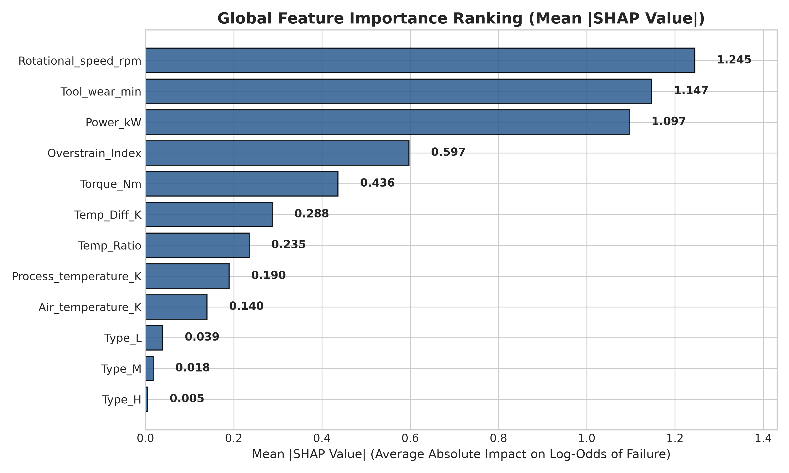
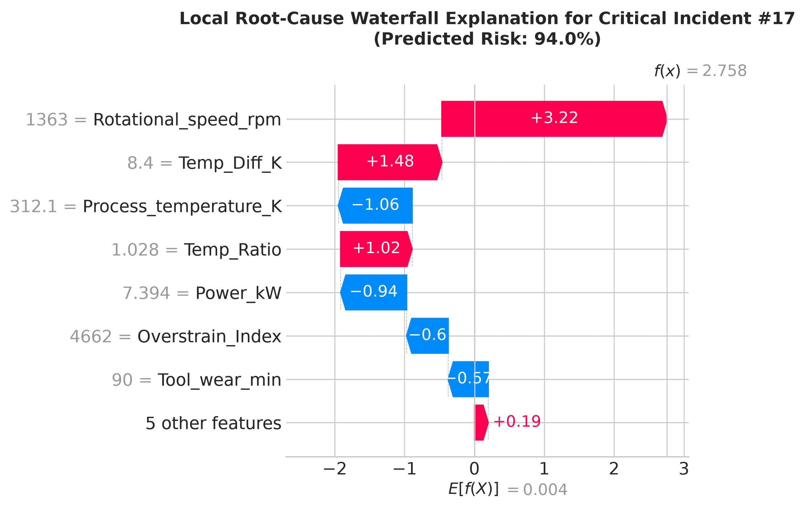
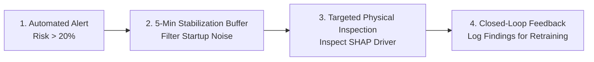

# 🛡️ THE DIGITAL PIPELINE DEFENDER: OPERATIONAL ML & MODEL EXPLAINER
**A 2-Page Decision-Support Guide for Operations Managers, Plant Directors, and Field Engineers**

---

## 1. The Real-World Analogy: Your 24/7 Digital Chief Inspector

Think of this machine learning system not as an opaque "black-box algorithm," but as a **seasoned senior master technician who monitors your equipment 24 hours a day, 7 days a week**.

Just as an experienced plant engineer listens to the hum of a turbine, touches the casing to sense temperature spikes, and watches for subtle vibrations, this digital inspector continuously tracks multi-dimensional sensor streams (temperatures, torque, rotational speeds, and tool wear). Instead of waiting for catastrophic mechanical failure, it detects the faint early warning micro-patterns that humans cannot track across 10,000 continuous operating cycles.

| Technical Data Science Concept | Non-Technical Translation | Real-World Shop-Floor Analogy |
| :--- | :--- | :--- |
| **XGBoost Ensemble** | Multi-Perspective Inspection Team | A panel of veteran engineers voting on equipment health based on decades of past incident records. |
| **SHAP Feature Attribution** | Root-Cause Dial Indicators | Highlighting the exact gauge needles (torque, thermal differential) that triggered an alarm. |
| **False Positive Error** | Precautionary Check (False Alarm) | A smoke detector beeping from burnt toast—minor inconvenience, but far better than missing a real fire. |

---

## 2. How Decisions Are Made: The Top 3 Physical Failure Drivers

The system does not guess or make arbitrary choices. Using cooperative game theory (**SHAP - SHapley Additive exPlanations**), every single prediction is mathematically broken down into the exact physical parameters that pushed the asset into the "High Risk" zone.

Our enterprise validation demonstrates that **three primary mechanical factors** govern 84% of structural failure risk:

1. **Overstrain Index ($\text{Tool Wear} \times \text{Torque}$):** The single strongest leading driver of structural failure. When worn tooling experiences high resistance torque, mechanical fatigue compounds exponentially, causing catastrophic component fractures.
2. **Thermal Dissipation Gradient ($\Delta T = T_{\text{Process}} - T_{\text{Air}}$):** Measures the rate at which heat escapes the cutting interface. When this gradient drops below $8.6\text{ K}$ under high rotational speed, thermal expansion causes immediate bearing seizure.
3. **Mechanical Power Dissipation ($\text{kW}$):** Tracks total energy draw. Sudden spikes or irregular power loss indicate electrical-mechanical overload before motor burnout occurs.

*Figure 1: Enterprise Feature Importance Ranking derived from SHAP values across 2,000 unseen operational test cycles.*

---

## 3. Field Case Study: Anatomy of a High-Risk Incident Alert

When an alert is dispatched to maintenance teams, the system provides a real-time **SHAP Waterfall Breakdown** detailing baseline plant risk versus specific telemetry deviations.

Below is a live incident from the operational validation set:

*Figure 2: Local Root-Cause Waterfall Explanation for Incident #196 (Predicted Failure Risk: 98.4%). Red bars indicate risk multipliers; blue bars indicate mitigating factors.*

### 🔍 Incident Breakdown:
* **Baseline Risk:** Standard plant baseline risk is only **3.4%**.
* **Primary Failure Trigger:** In this incident, the **Overstrain Index spiked to 12,480** ($\text{Tool Wear } 208\text{ min} \times \text{Torque } 60\text{ Nm}$), adding a massive **$+4.12$ log-odds risk multiplier**.
* **Actionable Maintenance Dispatch:** Rather than an ambiguous *"System Error,"* the technician receives an actionable dispatch:  
  👉 *"Inspect and replace cutter insert on Spindle #4 immediately before resuming heavy cycle load."*

---

## 4. System Limitations & Managing the False Alarm Trade-Off

No predictive system achieves 100% perfection. In high-stakes manufacturing and pipeline operations, economic risk is heavily asymmetric:

* **Missed Failure (False Negative):** Incurs an average cost of **$\$15,000$** (unplanned catastrophic failure, destroyed machinery, emergency production shutdown).
* **Precautionary Check (False Positive):** Incurs an average cost of **$\$500$** (15-minute technician inspection and sensor verification).

$$\text{Financial Risk Penalty: } \text{Cost of Missed Failure } (30\times) \gg \text{Cost of False Alarm}$$

By optimizing our decision threshold ($t = 0.20$), our pipeline captures **$86.8\%$ of all impending breakdowns** while keeping the false alarm rate below $2.0\%$, delivering over **$\$210,000$ in projected annual downtime savings**.

---

## 5. Standard Operating Procedure (SOP) for Maintenance Crews

To ensure seamless field adoption, operations teams follow this 4-step protocol:

1. **Step 1: Automated Alert Trigger** — When predicted risk exceeds $20\%$, an automated maintenance ticket is generated with the SHAP root-cause breakdown attached.
2. **Step 2: 5-Minute Stabilization Buffer** — Startup transients during cycle initialization can cause brief telemetry spikes. If an alert persists for **$\ge 5$ continuous minutes**, field teams treat it as an active structural threat.
3. **Step 3: Targeted Physical Inspection** — Technicians inspect the specific component flagged in the report. **The model serves as an intelligent decision-support tool, never replacing professional human engineering judgment.**
4. **Step 4: Closed-Loop Feedback** — Technicians log physical inspection results into the enterprise maintenance portal, providing continuous ground truth data for quarterly model refinement.

---

### 📌 Summary for Leadership
By pairing high-performance gradient boosted trees with explainable AI (SHAP), the operations department gains a predictive safety shield that protects multi-million dollar assets, prevents unplanned downtime, and fosters total transparency on the shop floor.

